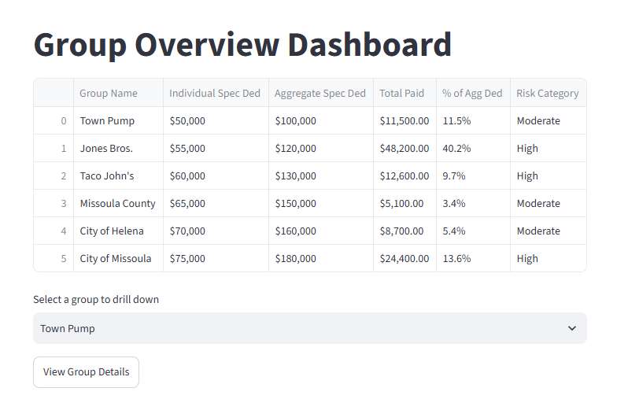
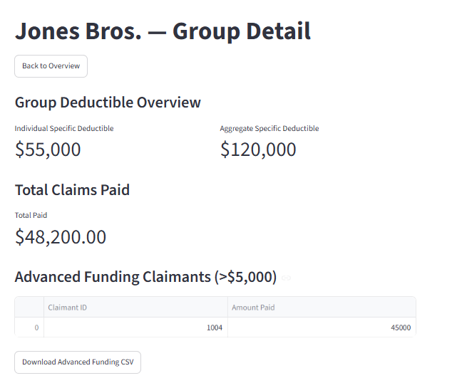
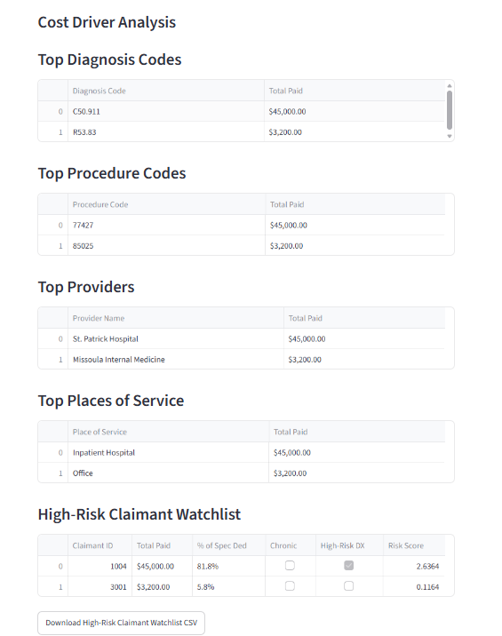
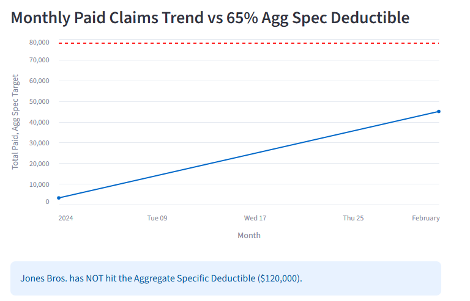

                     ██╗  ██╗███████╗ █████╗ ██╗     ████████╗██╗  ██╗
                     ██║  ██║██╔════╝██╔══██╗██║     ╚══██╔══╝██║  ██║
                     ███████║█████╗  ███████║██║        ██║   ███████║
                     ██╔══██║██╔══╝  ██╔══██║██║        ██║   ██╔══██║
                     ██║  ██║███████╗██║  ██║███████╗   ██║   ██║  ██║
                     ╚═╝  ╚═╝╚══════╝╚═╝  ╚═╝╚══════╝   ╚═╝   ╚═╝  ╚═╝

                       HEALTH CLAIMS ANALYTICS DASHBOARD

🏷️ Badges
<p align="center">
  
  
  
  
  
  
</p>

---

---


# 📸 Screenshots

<details>
  <summary><strong>Click to expand screenshots</strong></summary>
  <br>

  ### 🏥 Group Overview

  <p align="center">
  
</p>
<p align="center"><em>Clean landing page that allows users to select an employer group, view high‑level claim metrics, and navigate into detailed analytics.</em></p>


  ### 💵 Advanced Funding (Group Detail)
  <p align="center">
    
  </p>

<p align="center"><em>Displays claimants who exceed the advanced‑funding threshold, along with a downloadable CSV export. Highlights SQLAlchemy‑powered data filtering, threshold logic, and practical reporting features used in stop‑loss underwriting.</em></p>

  ### 📊 Cost Driver Analysis & High‑Risk Claimants
  <p align="center">
    
  </p>

<p align="center"><em>Breaks down top diagnosis, procedure, provider, and POS cost drivers, paired with a high‑risk claimant watchlist and exportable data. Shows real analytical depth, business‑relevant insights, and modular data‑processing pipelines.</em></p>

  ### 📈 Monthly Paid Claims Trend
  <p align="center">
    
  </p>

<p align="center"><em>An Altair visualization showing monthly paid claims with an aggregate threshold overlay. Demonstrates trend analysis, visual storytelling, and the ability to surface emerging cost patterns for underwriting and analytics teams.</em></p>
</details>

> [!IMPORTANT]
> All data shown in this dashboard is **fully synthetic** and does **not** represent real individuals, employers, or claims.  
> This project is for educational and portfolio purposes only.


 

</details>


---

📊 Overview
A Python/Streamlit dashboard that transforms raw health claims data into actionable insights, including deductible tracking, cost drivers, trend analysis, predictive modeling, and a high‑risk claimant watchlist.

This project demonstrates practical skills in:

Data engineering

Health claims analytics

Streamlit UI development

SQLAlchemy ORM modeling

Visualization and reporting

Predictive modeling for stop‑loss underwriting

---

🚀 Features
<details>
<summary><strong>📁 Group Overview Page</strong></summary>

Total paid claims

Individual & aggregate specific deductibles

Percent of deductible reached

Predictive stop‑loss exposure

Clean navigation into group‑level drill‑down pages

</details>

<details>
<summary><strong>📊 Group Detail Page</strong></summary>

Monthly paid claims trend with 65% aggregate threshold

Advanced funding claimants (> $5,000)

Claimants above specific deductible

Claimants above 50% of specific deductible

Diagnosis, procedure, provider, and POS cost drivers

High‑risk claimant watchlist

CSV exporting for all major tables

</details>

<details>
<summary><strong>🧱 Architecture Highlights</strong></summary>

Two‑page Streamlit UI using session state

SQLite + SQLAlchemy ORM backend

Altair visualizations

Modular analytics functions

Sample data loader for demo/testing

</details>

---

🧰 Tech Stack
Python 3.13+

Streamlit

SQLAlchemy

SQLite

Altair

Pandas

Pytest

---

```
📂 Project Structure
<details>
<summary><strong>📁 Click to Expand</strong></summary>

Code
health-claims-analytics-dashboard/
│
├── app/
│   ├── analytics.py
│   ├── dashboard.py
│   ├── database.py
│   ├── models.py
│   ├── sample_data.py
│   └── __init__.py
│
├── tests/
│   └── test_analytics.py
│
├── requirements.txt
├── README.md
└── claims.db   (local SQLite file — optional to include)
</details>
```
---

▶️ Running the App
<details>
<summary><strong>💻 Setup Instructions</strong></summary>

1. Create & activate a virtual environment
Code
python -m venv .venv
.venv\Scripts\activate
2. Install dependencies
Code
pip install -r requirements.txt
3. Run the Streamlit dashboard
Code
streamlit run app/dashboard.py
Dashboard opens at:

Code
http://localhost:8501
</details>

---

📈 Future Enhancements
Claimant‑level drill‑down pages

Multi‑group comparison dashboard

Machine learning risk scoring

Deployment to Streamlit Cloud or Azure

API integration for real claims feeds

Role‑based authentication

---

💡 Purpose
This project is designed as a portfolio‑ready example of building a real‑world analytics dashboard from scratch. It highlights my ability to work with data pipelines, visualization, predictive modeling, 
and interactive UI development — all essential skills for analytics, underwriting, and engineering roles.
